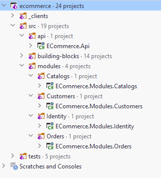
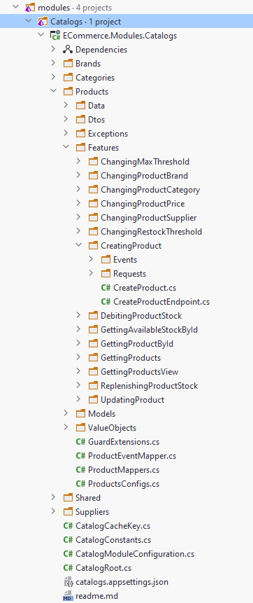

# 🛒 ECommerce Modular Monolith Sample
> `ECommerce Modular Monolith` is a fictional ecommerce sample, built with different software architecture and technologies like **Modular Monolith Architecture**, **Vertical Slice Architecture** , **CQRS Pattern**, **Domain Driven Design (DDD)**, **Event Driven Architecture**. For `communication` between independent modules, we use asynchronous messaging with using our [In-Memory Broker](src/BuildingBlocks/BuildingBlocks.Core/Messaging/Broker/InMemory/InMemoryBus.cs), and sometimes we use synchronous communication for real-time communications with using REST and gRPC calls.

This application ported to `microservices architecture` in another repository which is available in [ecommerce-microservices-sample](https://github.com/mehdihadeli/ecommerce-microservices-sample) repository.

🌀 Keep in mind this repository is work in progress and will be complete over time 🚀

## Plan

> This project is in progress, New features will be added over time.

High-level plan is represented in the table

| Feature | Status |
| ------- | ------ |
| Building Blocks | Completed ✔️ |
| API | Completed ✔️ |
| Identity Module | Completed ✔️ |
| Customer Module | Completed ✔️ |
| Catalog Module | Completed ✔️ |
| Order Module |  In Progress 👷‍|
| Shipping Module | Not Started 🚩 |
| Payment Module | Not Started 🚩 |

## Technologies - Libraries

- ✔️ **[`.NET 6`](https://dotnet.microsoft.com/download)** - .NET Framework and .NET Core, including ASP.NET and ASP.NET Core
- ✔️ **[`Npgsql Entity Framework Core Provider`](https://www.npgsql.org/efcore/)** - Npgsql has an Entity Framework (EF) Core provider. It behaves like other EF Core providers (e.g. SQL Server), so the general EF Core docs apply here as well
- ✔️ **[`FluentValidation`](https://github.com/FluentValidation/FluentValidation)** - Popular .NET validation library for building strongly-typed validation rules
- ✔️ **[`Swagger & Swagger UI`](https://github.com/domaindrivendev/Swashbuckle.AspNetCore)** - Swagger tools for documenting API's built on ASP.NET Core
- ✔️ **[`Serilog`](https://github.com/serilog/serilog)** - Simple .NET logging with fully-structured events
- ✔️ **[`Polly`](https://github.com/App-vNext/Polly)** - Polly is a .NET resilience and transient-fault-handling library that allows developers to express policies such as Retry, Circuit Breaker, Timeout, Bulkhead Isolation, and Fallback in a fluent and thread-safe manner
- ✔️ **[`Scrutor`](https://github.com/khellang/Scrutor)** - Assembly scanning and decoration extensions for Microsoft.Extensions.DependencyInjection
- ✔️ **[`Opentelemetry-dotnet`](https://github.com/open-telemetry/opentelemetry-dotnet)** - The OpenTelemetry .NET Client
- ✔️ **[`DuendeSoftware IdentityServer`](https://github.com/DuendeSoftware/IdentityServer)** - The most flexible and standards-compliant OpenID Connect and OAuth 2.x framework for ASP.NET Core
- ✔️ **[`Newtonsoft.Json`](https://github.com/JamesNK/Newtonsoft.Json)** - Json.NET is a popular high-performance JSON framework for .NET
- ✔️ **[`AspNetCore.Diagnostics.HealthChecks`](https://github.com/Xabaril/AspNetCore.Diagnostics.HealthChecks)** - Enterprise HealthChecks for ASP.NET Core Diagnostics Package
- ✔️ **[`Microsoft.AspNetCore.Authentication.JwtBearer`](https://www.nuget.org/packages/Microsoft.AspNetCore.Authentication.JwtBearer)** - Handling Jwt Authentication and authorization in .Net Core
- ✔️ **[`NSubstitute`](https://github.com/nsubstitute/NSubstitute)** - A friendly substitute for .NET mocking libraries.
- ✔️ **[`StyleCopAnalyzers`](https://github.com/DotNetAnalyzers/StyleCopAnalyzers)** - An implementation of StyleCop rules using the .NET Compiler Platform
- ✔️ **[`AutoMapper`](https://github.com/AutoMapper/AutoMapper)** - Convention-based object-object mapper in .NET.
- ✔️ **[`Hellang.Middleware.ProblemDetails`](https://github.com/khellang/Middleware/tree/master/src/ProblemDetails)** - A middleware for handling exception in .Net Core
- ✔️ **[`IdGen`](https://github.com/RobThree/IdGen)** - Twitter Snowflake-alike ID generator for .Net

## The Domain And Bounded Context - Modules Boundary

`ECommerce Modular Monolith` is a simple ecommerce api sample that has the basic business scenario for online purchasing with some dedicated modules. There are six possible `Bounded context` or `Module` for above business:

- `Identity Module`: the Identity Module, uses to authenticate and authorize users through a token. Also, this module is responsible for creating users and their corresponding roles and permission with using [.Net Core Identity](https://docs.microsoft.com/en-us/aspnet/core/security/authentication/identity) and Jwt authentication and authorization. I will add also [Identity Server](https://github.com/DuendeSoftware/IdentityServer) in future for this module. Each of `Administrator`, `Customer` and `Supplier` are a `User`, actually a `IdentityUser`. To be a User, User Registration is required. Each User is assigned one or more User Role. Each User Role has set of Permissions. A Permission defines whether User can invoke a particular action or not.

- `Catalog Module`: The Catalog Module presents the ability to add items to our ecommerce, It can be electronics, foods, books or anything else. Items can be grouped into categories and catalogs. A catalog is defined as a list of items that a company showcases online. the catalog is a collection of items, which can be grouped into categories. An item can be assigned to only one category or be direct child of a catalog without any category.
Buyer can browse the products list with supported filtering and sorting by product name and price. customer can see the detail of the product on the product list and in the detail page, can see a name, description, available product in the inventory,...

- `Customers Module`: This module is responsible for managing our customers information, track the activities and subscribing to get notification for out of stock products

- `Order Module`: The Orders module main purpose is to ecommerce order details and manage orders created by users on client side. This module is not designed to be a full order processing system like ERP but serves as storage for customer orders details and can be synchronized with different external processing systems.
Some of this module responsibilities are `Saving orders`, `Saving order drafts`, `Ability to view and manage fulfillment, packages`, `Change discounts`

- `Payment Module`: The payment module is responsible for payment process of our customer with different payment process and managing and tracking our payment history

- `Shipping Module`: The Shipping module provides the ability to extend shipping provider list with custom providers and also provides an interface and API for managing these shipping providers.
Some of shipping module capabilities are `Register Shipping methods`, `Edit Shipping method`, `Shipment details`, `Shipping settings`

## Application Structure

In this project I used [vertical slice architecture](https://jimmybogard.com/vertical-slice-architecture/) or [Restructuring to a Vertical Slice Architecture](https://codeopinion.com/restructuring-to-a-vertical-slice-architecture/) also I used [feature folder structure](http://www.kamilgrzybek.com/design/feature-folders/) in this project.

- We treat each request as a distinct use case or slice, encapsulating and grouping all concerns from front-end to back.
- When We adding or changing a feature in an application in n-tire architecture, we are typically touching many different "layers" in an application. we are changing the user interface, adding fields to models, modifying validation, and so on. Instead of coupling across a layer, we couple vertically along a slice and each change affects only one slice.
- We `Minimize coupling` `between slices`, and `maximize coupling` `in a slice`.
- With this approach, each of our vertical slices can decide for itself how to best fulfill the request. New features only add code, we're not changing shared code and worrying about side effects. For implementing vertical slice architecture using cqrs pattern is a good match.

Also here I used [CQRS](https://www.eventecommerce.com/cqrs-pattern) for decompose my features to very small parts that makes our application:

- maximize performance, scalability and simplicity.
- adding new feature to this mechanism is very easy without any breaking change in other part of our codes. New features only add code, we're not changing shared code and worrying about side effects.
- easy to maintain and any changes only affect on one command or query (or a slice) and avoid any breaking changes on other parts
- it gives us better separation of concerns and cross cutting concern (with help of MediatR behavior pipelines) in our code instead of a big service class for doing a lot of things.

With using [CQRS](https://event-driven.io/en/cqrs_facts_and_myths_explained/), our code will be more aligned with [SOLID principles](https://en.wikipedia.org/wiki/SOLID), especially with:

- [Single Responsibility](https://en.wikipedia.org/wiki/Single-responsibility_principle) rule - because logic responsible for a given operation is enclosed in its own type.
- [Open-Closed](https://en.wikipedia.org/wiki/Open%E2%80%93closed_principle) rule - because to add new operation you don’t need to edit any of the existing types, instead you need to add a new file with a new type representing that operation.

Here instead of some [Technical Splitting](http://www.kamilgrzybek.com/design/feature-folders/) for example a folder or layer for our `services`, `controllers` and `data models` which increase dependencies between our technical splitting and also jump between layers or folders, We cut each business functionality into some vertical slices, and inner each of these slices we have [Technical Folders Structure](http://www.kamilgrzybek.com/design/feature-folders/) specific to that feature (command, handlers, infrastructure, repository, controllers, data models, ...).

Usually, when we work on a given functionality we need some technical things for example:

- API endpoint (Controller)
- Request Input (Dto)
- Request Output (Dto)
- Some class to handle Request, For example Command and Command Handler or Query and Query Handler
- Data Model

Now we could all of these things beside each other and it decrease jumping and dependencies between some layers or folders.

Keeping such a split works great with CQRS. It segregates our operations and slices the application code vertically instead of horizontally. In Our CQRS pattern each command/query handler is a separate slice. This is where you can reduce coupling between layers. Each handler can be a separated code unit, even copy/pasted. Thanks to that, we can tune down the specific method to not follow general conventions (e.g. use custom SQL query or even different storage). In a traditional layered architecture, when we change the core generic mechanism in one layer, it can impact all methods.

### High Level Structure

### Catalogs Module Structure

## Vertical Slice Flow
TODO

## Prerequisites

1. This application uses `Https` for hosting apis, to setup a valid certificate on your machine, you can create a [Self-Signed Certificate](https://docs.microsoft.com/en-us/dotnet/core/additional-tools/self-signed-certificates-guide#create-a-self-signed-certificate).
2. Install git - [https://git-scm.com/downloads](https://git-scm.com/downloads).
3. Install .NET Core 6.0 - [https://dotnet.microsoft.com/download/dotnet/6.0](https://dotnet.microsoft.com/download/dotnet/6.0).
4. Install Visual Studio 2022, Rider or VSCode.
5. Install docker - [https://docs.docker.com/docker-for-windows/install/](https://docs.docker.com/docker-for-windows/install/).
6. Make sure that you have ~10GB disk space.
7. Clone Project [https://github.com/mehdihadeli/ecommerce-modular-monolith-sample](https://github.com/mehdihadeli/ecommerce-modular-monolith-sample), make sure that's compiling
8. Run the [docker-compose.infrastructure.yaml](deployments/docker-compose/docker-compose.infrastructure.yaml) file, for running prerequisites infrastructures with `docker-compose -f ./deployments/docker-compose.infrastructure.yaml -d` command.
9. Open [ecommerce.sln](./ECommerce.sln) solution.
